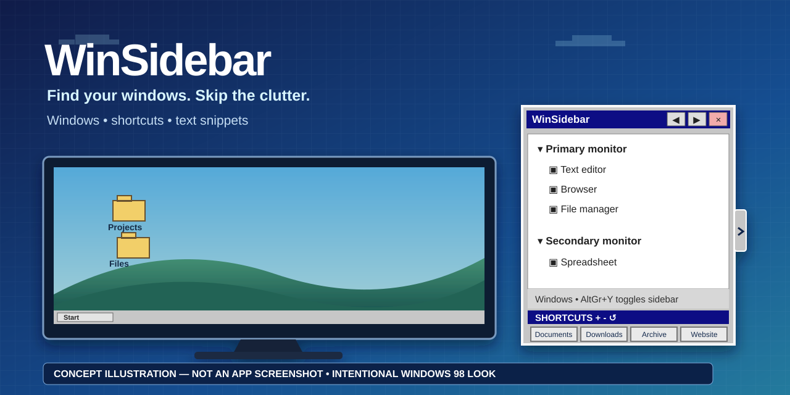

# WinSidebar 2.0

**English** · [Português (Brasil)](docs/i18n/README.pt-BR.md) · [Español](docs/i18n/README.es-ES.md) · [Русский](docs/i18n/README.ru-RU.md) · [简体中文](docs/i18n/README.zh-CN.md)

> **Concept illustration, not an application screenshot.** The Windows 98-inspired appearance is intentional.

WinSidebar is a portable, self-contained Windows 10/11 x64 sidebar for finding and switching between open windows, launching frequently used folders or websites, and pasting reusable text snippets. Version 2.0 is the first release line with the complete five-language runtime, expandable shortcuts and text snippets.

**Download:** [WinSidebar 2.0](https://github.com/hamthet/WinSidebar/releases/tag/v2.0) · **Tutorial:** [English](docs/TUTORIAL.md)

## What changed in 2.0

- Five runtime languages: English, Brazilian Portuguese, Spanish, Russian and Simplified Chinese.
- English is the default for a brand-new installation; the first-run chooser lets the user select any supported language.
- Up to 12 configurable shortcuts, organized in rows of four.
- Up to 8 reusable text snippets with per-snippet keyboard shortcuts.
- Window context commands for temporary rename/reset and persistent application-ignore rules.
- Independent restore controls for shortcuts and snippets.
- Horizontal and vertical sidebar size cycles with persisted settings.
- AltGr+Y toggles the sidebar open or closed.
- Self-contained, single-file .NET 8 Windows x64 distribution: end users do not install .NET separately.

## Quick start

1. Download the v2.0 ZIP and extract it to a folder you control.
2. Run WinSidebar.exe.
3. On a new profile, English is preselected. Choose another language if preferred.
4. Click the narrow sidebar tab or press AltGr+Y to open/close the sidebar.
5. Click a listed window to activate it.
6. Click a shortcut to open it; right-click the shortcut to edit it.
7. Click a text snippet to paste it into the most recently active external application; use the gear button to edit the snippet.

The distribution is portable and unsigned. Windows SmartScreen or organizational policy may warn about an unsigned executable.

## Keyboard

- **AltGr+Y** — toggle the sidebar.
- **F1–F4** — open shortcuts 1–4.
- **Shift+F1–F4** — default hotkeys for snippets 1–4.
- Each snippet can be assigned **None** or **Shift+F1 through Shift+F12**. Duplicate snippet hotkeys are rejected.

The former window-list Shift+F navigation is not part of 2.0.

## Shortcuts and snippets

The **Shortcuts** section starts with four entries and can grow to 12. Use + to add a row of four, − to remove the last added row, and Restore to return only the shortcut section to defaults. Left-click opens a shortcut; right-click edits its name, target, type, browser and icon.

The **Scripts** section stores literal text snippets, not executable scripts. It starts with four entries and can grow to 8. Use +, − and Restore independently from the shortcut section. Clicking a snippet attempts to return focus to the previously active external window and paste the saved text. The gear button edits the snippet name, content and hotkey.

## Window list

Eligible top-level windows are grouped by monitor. Clicking a window activates it. The window context menu can temporarily rename a listed window, reset that temporary name, or persistently ignore the corresponding application. Ignored applications can be managed from the general context menu.

WinSidebar uses Windows window metadata and heuristics; it is not a replacement for the operating system's Alt+Tab implementation.

## Languages

Supported runtime languages:

- English — en-US
- Português (Brasil) — pt-BR
- Español — es-ES
- Русский — ru-RU
- 简体中文 — zh-CN

A new installation defaults to English regardless of the Windows display language. The selected language is then persisted in the WinSidebar profile. Legacy profiles created before language persistence may retain Portuguese until the user explicitly chooses another language.

## Data and privacy

WinSidebar stores its profile under:

    %LOCALAPPDATA%\WinSidebar

The profile can contain settings.ini, shortcuts.xml, snippets.json, ignored-apps.json, backups and copied custom icons. User-authored shortcut names, paths, snippet text and external window titles are never translated.

WinSidebar does not install automatic startup, does not change the default browser and does not send telemetry.

Text snippets use the Windows clipboard temporarily for paste injection and attempt to restore the previous clipboard content afterward. Windows security boundaries can prevent simulated input into elevated applications.

## Portable distribution

WinSidebar 2.0 targets Windows x64 and is published as a self-contained single executable. The bundled .NET 8 runtime is inside WinSidebar.exe. End users do not need a separate .NET download, PowerShell, Git, a compiler or an installer.

To uninstall, exit WinSidebar and delete the executable. Delete %LOCALAPPDATA%\WinSidebar only if you also want to remove its saved profile.

## Source and license

Source code, localization catalogs and tests are in this repository. WinSidebar is released under the [MIT License](LICENSE).

For detailed use, see the [English tutorial](docs/TUTORIAL.md).