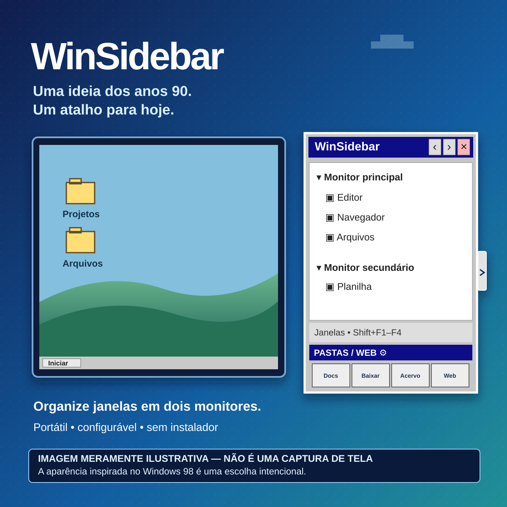

# Divulgação do WinSidebar — LinkedIn

> **Imagem meramente ilustrativa, criada com auxílio de IA.** Não é uma captura real do programa. A estética inspirada no Windows 98 é **intencional**.

## Texto sugerido para o post

Eu sentia falta de uma maneira simples de encontrar uma janela quando estava com vários programas abertos, especialmente em dois monitores. Em vez de depender só do Alt+Tab, criei o **WinSidebar**.

É uma barra lateral retrátil que organiza as janelas por monitor e deixa quatro atalhos para pastas ou sites à mão. Dá para configurar destinos, ícones e até o navegador usado em cada atalho web.

E sim: a interface inspirada no Windows 98 é **de propósito**. Queria uma ferramenta prática com aquele visual clássico.

A primeira versão pública já está disponível para **Windows 10/11 de 64 bits**. É portátil: basta extrair o ZIP e abrir o executável. Não há instalador nem download separado de .NET.

Projeto e download: https://github.com/hamthet/WinSidebar/releases/tag/v1.0.0

**A arte deste post é meramente ilustrativa, gerada com auxílio de IA; não é uma captura real do aplicativo.**

Se você testar, conta para mim: o que mais atrapalha sua troca de janelas no dia a dia?

## Tutorial rápido: como publicar

1. Use a **arte quadrada** em [`assets/linkedin-ilustrativo.png`](../assets/linkedin-ilustrativo.png), caso o arquivo PNG esteja disponível. O arquivo-fonte em SVG fica em [`assets/linkedin-ilustrativo.svg`](../assets/linkedin-ilustrativo.svg); o PNG é preparado automaticamente no próprio GitHub, não na máquina do usuário final.
2. Crie uma publicação no LinkedIn, envie a imagem PNG e cole o texto acima. Você pode adaptar o relato para corresponder à sua experiência.
3. Confira se a frase **“Imagem meramente ilustrativa”** ficou visível na arte e no texto. Não afirme que o mockup é uma captura de tela, nem que o programa tem controles ou recursos que não aparecem na versão distribuída.
4. Inclua o link oficial da **release**, não arquivos compartilhados informalmente. Se preferir, coloque o link no primeiro comentário e indique isso no texto.
5. Após publicar, responda às dúvidas sobre compatibilidade e convide interessados a abrir [issues](https://github.com/hamthet/WinSidebar/issues/new) sem divulgar caminhos ou dados pessoais em capturas.

**Nota:** o executável ainda não é assinado digitalmente; políticas de segurança podem alertar ou bloquear a execução. Não oriente as pessoas a contornar regras de computadores corporativos.