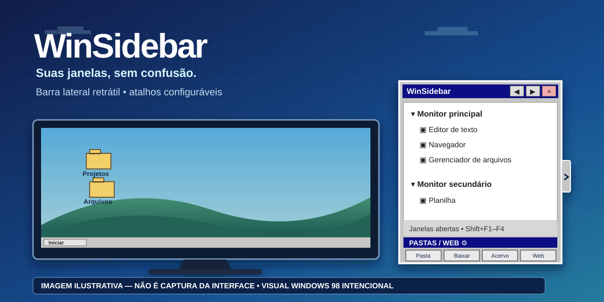

# Tutorial do WinSidebar

> **Sobre as imagens:** as artes desta página são **meramente ilustrativas**, geradas com auxílio de IA. Elas não são capturas de tela, nem uma reprodução exata da interface. O visual inspirado no Windows 98 é **intencional**.

## 1. Baixe e execute — sem instalar dependências

1. Acesse a [página oficial da versão 1.0.0](https://github.com/hamthet/WinSidebar/releases/tag/v1.0.0).
2. Em **Assets**, baixe `WinSidebar-v1.0.0-win-x64.zip` (não escolha os arquivos automáticos *Source code* se você só quer usar o programa).
3. Extraia o ZIP para uma pasta do seu usuário, como **Downloads** ou **Documentos**. Dentro dele há apenas `WinSidebar.exe` e `LEIA-ME.txt`.
4. Dê dois cliques em `WinSidebar.exe`. Pronto: sem instalador, PowerShell, Git, Visual Studio ou download separado do .NET.

O programa destina-se ao **Windows 10 ou 11 de 64 bits**. O executável não possui assinatura digital; o Windows ou a política de sua organização pode alertar ou impedir a execução. Confirme sempre que baixou a versão no repositório oficial. Em computador administrado, respeite a política de TI; não contorne bloqueios de segurança.

## 2. Abra e recolha

A pequena **aba na lateral do monitor** permanece acessível. Clique nela para abrir ou recolher a lista de janelas. A janela aberta mostra os aplicativos organizados por monitor. Para voltar a um aplicativo, selecione-o na lista e dê dois cliques ou use o atalho de ativação.

Os atalhos de teclado são:

| Tecla | Ação |
| --- | --- |
| `Shift + F1` | Abrir ou recolher a barra |
| `Shift + F2` | Selecionar a janela anterior |
| `Shift + F3` | Selecionar a próxima janela |
| `Shift + F4` | Ativar a janela selecionada |

Se uma combinação estiver reservada por outro programa, feche a outra ferramenta ou use a interface com o mouse. Para evitar conflitos de atalhos globais, não deixe outra edição da barra aberta simultaneamente.

## 3. Ajuste a posição e o tamanho

No **cabeçalho**, use os controles para diminuir ou aumentar a largura, mover a barra para a borda oposta e encerrar pelo **X** vermelho. Para escolher entre monitor principal e secundário, abra o menu de contexto da aba/barra e selecione o monitor disponível. A presença de um monitor secundário depende da configuração do Windows.

## 4. Configure seus quatro atalhos

Na faixa **PASTAS / WEB**, clique na **engrenagem** para entrar no modo de configuração. Nesse modo, clicar em um ícone abre o editor **em vez de abrir a pasta ou o site**. Edite o nome, escolha o tipo de destino, selecione a pasta ou informe a URL, ajuste o ícone e, para sites, escolha o navegador desejado. Salve as alterações e clique novamente na engrenagem para sair do modo de configuração.

A primeira execução oferece padrões genéricos: **Documentos**, **Downloads**, **Acervo** (sem destino definido) e **Google**. Não há pasta pessoal, nome de usuário ou site particular incorporado aos padrões da edição pública. O navegador configurado no atalho não muda o navegador padrão do Windows.

## 5. Onde ficam as preferências?

As configurações são gravadas na pasta `%LOCALAPPDATA%\WinSidebar`, separada das preferências de outras versões ou instalações. O executável não instala inicialização automática nem substitui outro aplicativo.

Para remover o WinSidebar, encerre-o pelo X e apague `WinSidebar.exe`. Se também quiser apagar os atalhos e as preferências **desta edição**, remova `%LOCALAPPDATA%\WinSidebar`. Não remova pastas de outras versões.

## 6. Ajuda, erros e sugestões

Se algo não funcionar, abra uma [issue no repositório](https://github.com/hamthet/WinSidebar/issues/new) e informe sua versão do Windows, a ação executada e a mensagem de erro. Antes de enviar capturas, oculte nomes, caminhos, títulos de janelas, URLs e outras informações pessoais.

**Download oficial:** [WinSidebar 1.0.0](https://github.com/hamthet/WinSidebar/releases/tag/v1.0.0).