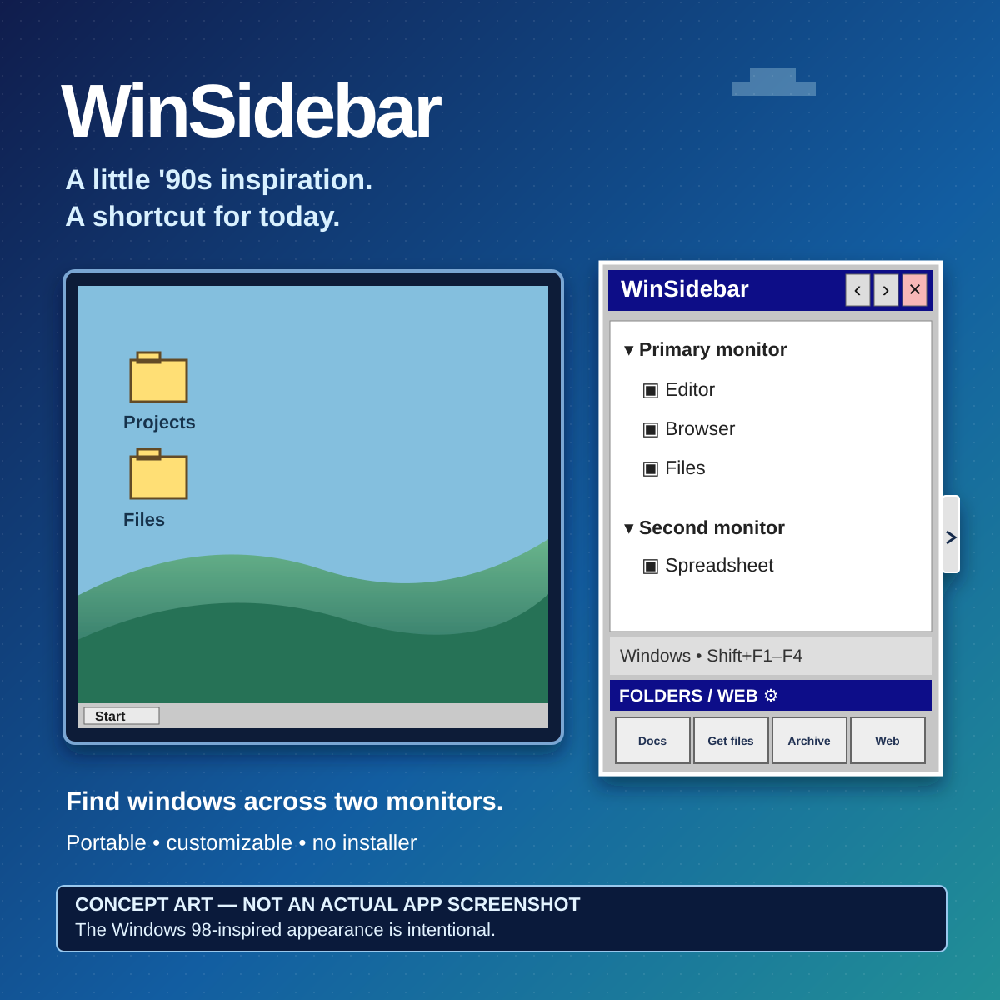

# WinSidebar outreach — LinkedIn

**[English README](../../README.md)** · [Português (Brasil)](../DIVULGACAO.md)

> **Concept artwork created with AI assistance, not an actual screenshot.** The Windows 98-inspired look is an intentional visual choice. The currently published v1.0.0 app still has a Portuguese interface.

## Suggested post

When I had several programs open, especially across two monitors, I wanted a straightforward way to find the right window without relying only on Alt+Tab. That is why I made **WinSidebar**.

It is a collapsible sidebar that groups windows by monitor and keeps four shortcuts to folders or websites within reach. You can choose the shortcuts' destinations and icons and even which browser opens each website.

And yes, the Windows 98-inspired interface is **intentional**. I wanted a practical utility with a classic look.

The first public version is available for **64-bit Windows 10 and Windows 11**. It is portable: extract the ZIP and run the executable. There is no installer and no separate .NET download. **The current application's interface is in Portuguese; English localization is being prepared.**

Official project and download: https://github.com/hamthet/WinSidebar/releases/tag/v1.0.0

**The promotional image is an AI-assisted concept illustration, not a screenshot of the actual application.**

If you try it, what makes switching between windows difficult in your daily workflow?

## How to publish

1. Use the [English square illustration](../../assets/i18n/en-US/linkedin-illustration.svg). An English PNG can be generated from this SVG by the project's artwork workflow; do not use the original Portuguese PNG for an English post. If the English PNG is not available yet, export the SVG to PNG with an image editor before uploading.
2. Create a LinkedIn post, upload the English PNG, and adapt the suggested copy to accurately reflect your own experience.
3. Make sure the **concept illustration / not a screenshot** disclaimer remains legible both on the artwork and in the post. Do not claim that the illustration reproduces the current interface or contains controls not present in the distributed release.
4. Link to the official **release**, not an unofficial file share. Alternatively, put the release link in the first comment and mention that in the post.
5. When responding to feedback, encourage users to [open issues](https://github.com/hamthet/WinSidebar/issues/new) without disclosing personal paths, window titles, or URLs in screenshots.

**Security note:** the executable is not digitally signed. Security policies may warn about or block it; do not advise users to bypass managed-device policies.
