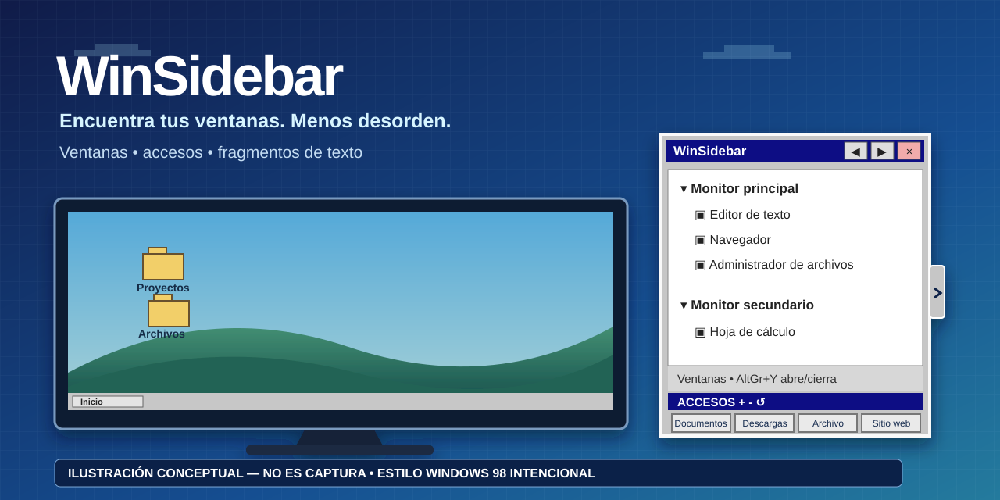

# WinSidebar 2.0

[English](../../README.md) · [Português (Brasil)](README.pt-BR.md) · **Español** · [Русский](README.ru-RU.md) · [简体中文](README.zh-CN.md)
## ¿Solo quieres usar el programa?

1. Descarga **WinSidebar-v2.0-win-x64.zip** desde Releases.
2. Extrae el ZIP.
3. Haz doble clic en **WinSidebar.exe**.

No necesitas instalador ni descargar .NET por separado. Si no eres técnico, empieza por [START-HERE](START-HERE.es-ES.txt) o las [preguntas frecuentes](FAQ.es-ES.md).

> **Ilustración conceptual, no una captura de pantalla de la aplicación.** La apariencia inspirada en Windows 98 es intencional.

WinSidebar es una barra lateral portátil y autocontenida para Windows 10/11 x64 que permite localizar y cambiar entre ventanas abiertas, abrir carpetas o sitios frecuentes y pegar fragmentos de texto reutilizables. La versión 2.0 es la primera línea de lanzamiento con runtime completo en cinco idiomas, accesos directos ampliables y fragmentos de texto.

**Descarga:** [WinSidebar 2.0](https://github.com/hamthet/WinSidebar/releases/tag/v2.0) · **Tutorial:** [Español](TUTORIAL.es-ES.md)

## Novedades de 2.0

- Cinco idiomas en la aplicación: inglés, portugués de Brasil, español, ruso y chino simplificado.
- Inglés es el idioma predeterminado de una instalación nueva; el selector inicial permite elegir cualquiera de los cinco.
- Hasta 12 accesos directos configurables, organizados en filas de cuatro.
- Hasta 8 fragmentos de texto reutilizables con atajo de teclado por fragmento.
- Menú contextual de ventanas para renombrado temporal, restauración del nombre y reglas persistentes para ignorar aplicaciones.
- Restauración independiente de accesos directos y fragmentos.
- Ciclos de ancho y alto de la barra con persistencia.
- AltGr+Y abre o cierra la barra lateral.
- Distribución Windows x64 autocontenida en un único ejecutable .NET 8; el usuario no instala .NET por separado.

## Inicio rápido

1. Descarga el ZIP de v2.0 y extráelo en una carpeta bajo tu control.
2. Ejecuta WinSidebar.exe.
3. En un perfil nuevo, English aparece preseleccionado. Elige otro idioma si lo prefieres.
4. Haz clic en la pestaña estrecha o pulsa AltGr+Y para abrir/cerrar la barra.
5. Haz clic en una ventana para activarla.
6. Haz clic en un acceso directo para abrirlo; clic derecho para editarlo.
7. Haz clic en un fragmento para pegarlo en la última aplicación externa activa; usa el engranaje para editarlo.

La distribución es portátil y no está firmada digitalmente. Windows SmartScreen o las políticas de la organización pueden mostrar advertencias.

## Teclado

- **AltGr+Y** — alterna la barra lateral.
- **F1–F4** — abren los accesos directos 1–4.
- **Shift+F1–F4** — atajos predeterminados de los fragmentos 1–4.
- Cada fragmento puede usar **Ninguno** o **Shift+F1 a Shift+F12**. No se permiten duplicados entre fragmentos.

La antigua navegación de la lista de ventanas mediante Shift+F no forma parte de 2.0.

## Accesos directos y fragmentos

La sección **Accesos directos** empieza con cuatro elementos y puede crecer hasta 12. Usa + para añadir una fila de cuatro, − para quitar la última fila añadida y Restaurar para restablecer solamente los accesos directos. Clic izquierdo abre; clic derecho edita nombre, destino, tipo, navegador e icono.

La sección **Scripts** almacena texto literal, no scripts ejecutables. Empieza con cuatro elementos y puede crecer hasta 8. Sus controles +, − y Restaurar son independientes. Al hacer clic en un fragmento, WinSidebar intenta devolver el foco a la ventana externa anterior y pegar el texto guardado. El engranaje edita nombre, contenido y atajo.

## Lista de ventanas

Las ventanas superiores elegibles se agrupan por monitor. Un clic activa la ventana. El menú contextual permite renombrar temporalmente una ventana listada, restablecer ese nombre temporal o ignorar de forma persistente la aplicación correspondiente. Las aplicaciones ignoradas se administran desde el menú contextual general.

WinSidebar usa metadatos y heurísticas de ventanas de Windows; no sustituye la implementación de Alt+Tab del sistema operativo.

## Idiomas

Idiomas de runtime compatibles:

- English — en-US
- Português (Brasil) — pt-BR
- Español — es-ES
- Русский — ru-RU
- 简体中文 — zh-CN

Una instalación nueva usa inglés como predeterminado, independientemente del idioma de Windows. La selección se guarda en el perfil. Los perfiles antiguos creados antes de guardar el idioma pueden conservar portugués hasta que el usuario elija otro idioma.

## Datos y privacidad

El perfil de WinSidebar se guarda en:

    %LOCALAPPDATA%\WinSidebar

Puede contener settings.ini, shortcuts.xml, snippets.json, ignored-apps.json, copias de seguridad e iconos personalizados copiados. Los nombres, rutas, textos de fragmentos y títulos de ventanas aportados por el usuario nunca se traducen.

WinSidebar no configura inicio automático, no cambia el navegador predeterminado y no envía telemetría.

Los fragmentos usan temporalmente el portapapeles de Windows para pegar y después intentan restaurar su contenido anterior. Los límites de seguridad de Windows pueden impedir la entrada simulada en aplicaciones elevadas.

## Distribución portátil

WinSidebar 2.0 está destinado a Windows x64 y se publica como un único ejecutable autocontenido. El runtime .NET 8 está incluido dentro de WinSidebar.exe. El usuario final no necesita descargar .NET, PowerShell, Git, compilador ni instalador.

Para desinstalar, cierra WinSidebar y elimina el ejecutable. Elimina %LOCALAPPDATA%\WinSidebar solo si también quieres borrar el perfil guardado.

## Código y licencia

El código fuente, los catálogos de idioma y las pruebas están en este repositorio. WinSidebar se distribuye bajo la [Licencia MIT](../../LICENSE).

Para más detalles, consulta el [tutorial en español](TUTORIAL.es-ES.md).

## Ayuda y soporte

Si algo no funciona, consulta [Cómo pedir ayuda](SUPPORT.es-ES.md). No necesitas conocimientos técnicos para informar de un problema.
