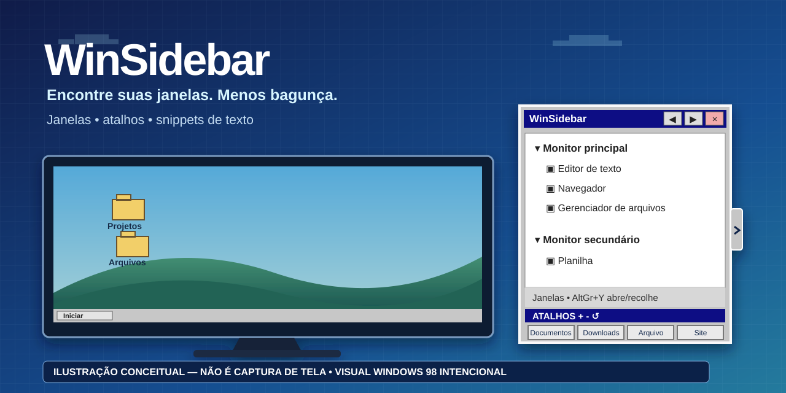

# WinSidebar 2.0

[English](../../README.md) · **Português (Brasil)** · [Español](README.es-ES.md) · [Русский](README.ru-RU.md) · [简体中文](README.zh-CN.md)

> **Ilustração conceitual, não uma captura de tela do aplicativo.** A aparência inspirada no Windows 98 é intencional.

WinSidebar é uma barra lateral portátil e autocontida para Windows 10/11 x64, feita para localizar e alternar entre janelas abertas, abrir pastas ou sites frequentes e colar trechos de texto reutilizáveis. A versão 2.0 é a primeira linha de lançamento com runtime completo em cinco idiomas, atalhos expansíveis e snippets de texto.

**Download:** [WinSidebar 2.0](https://github.com/hamthet/WinSidebar/releases/tag/v2.0) · **Tutorial:** [Português](TUTORIAL.pt-BR.md)

## O que mudou na 2.0

- Cinco idiomas no aplicativo: inglês, português brasileiro, espanhol, russo e chinês simplificado.
- Inglês é o padrão de uma instalação nova; o seletor inicial permite escolher qualquer idioma suportado.
- Até 12 atalhos configuráveis, em linhas de quatro.
- Até 8 snippets de texto reutilizáveis, com atalho de teclado por snippet.
- Menu de contexto das janelas para renomear temporariamente, restaurar o nome e ignorar aplicativos de forma persistente.
- Restauração independente de atalhos e snippets.
- Ciclos de largura e altura da barra com persistência.
- AltGr+Y abre ou recolhe a barra.
- Distribuição Windows x64 autocontida em um único executável .NET 8; o usuário não instala .NET separadamente.

## Início rápido

1. Baixe o ZIP da versão 2.0 e extraia em uma pasta sob seu controle.
2. Execute WinSidebar.exe.
3. Em um perfil novo, English vem pré-selecionado. Escolha outro idioma se desejar.
4. Clique na aba estreita ou pressione AltGr+Y para abrir/recolher.
5. Clique em uma janela listada para ativá-la.
6. Clique em um atalho para abri-lo; clique com o botão direito para editar.
7. Clique em um snippet para colá-lo no aplicativo externo que estava ativo; use a engrenagem para editar o snippet.

A distribuição é portátil e não possui assinatura digital. O Windows SmartScreen ou políticas da organização podem exibir avisos.

## Teclado

- **AltGr+Y** — alterna a barra entre aberta e recolhida.
- **F1–F4** — abrem os atalhos 1–4.
- **Shift+F1–F4** — atalhos padrão dos snippets 1–4.
- Cada snippet pode usar **Nenhum** ou **Shift+F1 até Shift+F12**. Duplicidades entre snippets são rejeitadas.

A antiga navegação da lista de janelas por Shift+F não faz parte da 2.0.

## Atalhos e snippets

A seção **Atalhos** começa com quatro itens e pode chegar a 12. Use + para adicionar uma linha de quatro, − para remover a última linha adicionada e Restaurar para voltar somente os atalhos aos padrões. Clique normal abre; botão direito edita nome, destino, tipo, navegador e ícone.

A seção **Scripts** armazena snippets de texto literal, não scripts executáveis. Começa com quatro itens e pode chegar a 8. +, − e Restaurar são independentes da seção de atalhos. Ao clicar em um snippet, o WinSidebar tenta devolver o foco à janela externa anteriormente ativa e colar o texto salvo. A engrenagem edita nome, conteúdo e hotkey.

## Lista de janelas

Janelas superiores elegíveis são agrupadas por monitor. Um clique ativa a janela. O menu de contexto permite renomear temporariamente uma janela listada, restaurar esse nome temporário ou ignorar persistentemente o aplicativo correspondente. Aplicativos ignorados podem ser gerenciados pelo menu de contexto geral.

O WinSidebar usa metadados e heurísticas de janelas do Windows; não substitui a implementação de Alt+Tab do sistema operacional.

## Idiomas

Idiomas de runtime suportados:

- English — en-US
- Português (Brasil) — pt-BR
- Español — es-ES
- Русский — ru-RU
- 简体中文 — zh-CN

Uma instalação nova usa inglês como padrão, independentemente do idioma de exibição do Windows. A escolha feita pelo usuário é persistida no perfil. Perfis legados criados antes da persistência de idioma podem permanecer em português até uma escolha explícita.

## Dados e privacidade

O perfil do WinSidebar fica em:

    %LOCALAPPDATA%\WinSidebar

Ele pode conter settings.ini, shortcuts.xml, snippets.json, ignored-apps.json, backups e cópias de ícones personalizados. Nomes e caminhos definidos pelo usuário, textos de snippets e títulos de janelas externas nunca são traduzidos.

O WinSidebar não instala inicialização automática, não muda o navegador padrão e não envia telemetria.

Os snippets usam temporariamente a área de transferência do Windows para a colagem e tentam restaurar o conteúdo anterior em seguida. Barreiras de segurança do Windows podem impedir entrada simulada em aplicativos elevados.

## Distribuição portátil

WinSidebar 2.0 é destinado a Windows x64 e publicado como um único executável autocontido. O runtime .NET 8 está incluído dentro de WinSidebar.exe. O usuário final não precisa baixar .NET, PowerShell, Git, compilador ou instalador.

Para remover, encerre o WinSidebar e apague o executável. Apague %LOCALAPPDATA%\WinSidebar somente se também quiser remover o perfil salvo.

## Código-fonte e licença

Código-fonte, catálogos de idioma e testes estão neste repositório. WinSidebar é distribuído sob a [Licença MIT](../../LICENSE).

Para uso detalhado, consulte o [tutorial em português](TUTORIAL.pt-BR.md).