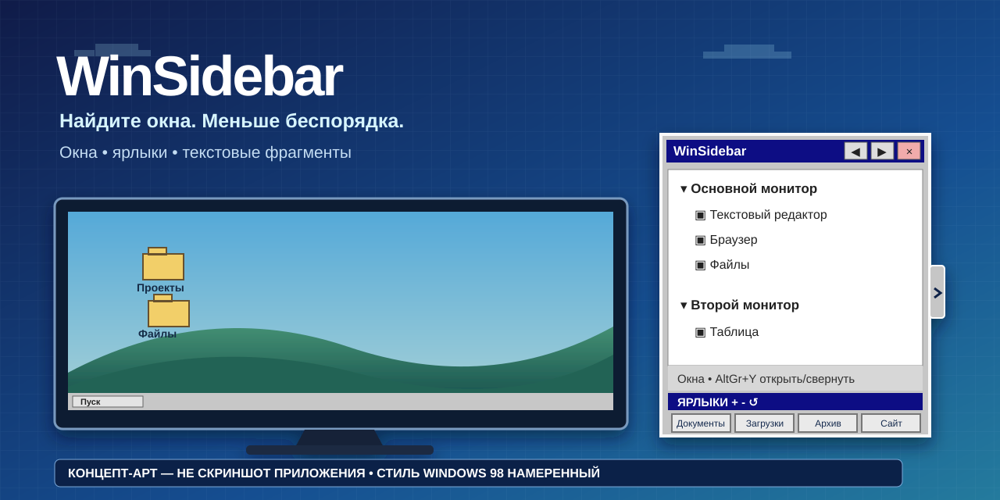

# WinSidebar 2.0

[English](../../README.md) · [Português (Brasil)](README.pt-BR.md) · [Español](README.es-ES.md) · **Русский** · [简体中文](README.zh-CN.md)
## Хотите просто запустить программу?

1. Скачайте **WinSidebar-v2.0-win-x64.zip** в Releases.
2. Распакуйте ZIP.
3. Дважды щёлкните **WinSidebar.exe**.

Установщик и отдельная загрузка .NET не нужны. Если вы не технический пользователь, начните с [START-HERE](START-HERE.ru-RU.txt) или [частых вопросов](FAQ.ru-RU.md).

> **Концептуальная иллюстрация, а не снимок экрана приложения.** Оформление в духе Windows 98 выбрано намеренно.

WinSidebar — переносимая самодостаточная боковая панель для Windows 10/11 x64. Она помогает находить открытые окна и переключаться между ними, запускать часто используемые папки и сайты и вставлять сохранённые текстовые фрагменты. Версия 2.0 — первая линия выпуска с полноценным интерфейсом на пяти языках, расширяемыми ярлыками и текстовыми фрагментами.

**Скачать:** [WinSidebar 2.0](https://github.com/hamthet/WinSidebar/releases/tag/v2.0) · **Руководство:** [Русский](TUTORIAL.ru-RU.md)

## Что нового в 2.0

- Пять языков приложения: английский, бразильский португальский, испанский, русский и упрощённый китайский.
- Для новой установки по умолчанию выбран английский; при первом запуске можно выбрать любой поддерживаемый язык.
- До 12 настраиваемых ярлыков, по четыре в строке.
- До 8 повторно используемых текстовых фрагментов с отдельными горячими клавишами.
- Контекстное меню окна: временное переименование, сброс имени и постоянные правила игнорирования приложений.
- Независимое восстановление настроек ярлыков и фрагментов.
- Циклический выбор ширины и высоты панели с сохранением.
- AltGr+Y открывает или сворачивает панель.
- Самодостаточный однофайловый выпуск .NET 8 для Windows x64: пользователю не требуется отдельно устанавливать .NET.

## Быстрый старт

1. Скачайте ZIP версии 2.0 и распакуйте его в доступную вам папку.
2. Запустите WinSidebar.exe.
3. Для нового профиля заранее выбран English. При необходимости выберите другой язык.
4. Нажмите узкую вкладку панели или AltGr+Y, чтобы открыть/свернуть её.
5. Нажмите окно в списке, чтобы активировать его.
6. Нажмите ярлык, чтобы открыть его; щёлкните правой кнопкой для редактирования.
7. Нажмите текстовый фрагмент, чтобы вставить его в последнее активное внешнее приложение; шестерёнка открывает редактор.

Приложение переносимое и не имеет цифровой подписи. Windows SmartScreen или корпоративные политики могут показать предупреждение.

## Клавиатура

- **AltGr+Y** — открыть/свернуть панель.
- **F1–F4** — открыть ярлыки 1–4.
- **Shift+F1–F4** — стандартные горячие клавиши фрагментов 1–4.
- Для каждого фрагмента можно выбрать **Нет** или **Shift+F1…Shift+F12**. Повторное назначение одной комбинации двум фрагментам запрещено.

Прежняя навигация по списку окон через Shift+F в 2.0 отсутствует.

## Ярлыки и текстовые фрагменты

Раздел **Ярлыки** начинается с четырёх элементов и расширяется до 12. Кнопка + добавляет строку из четырёх, − удаляет последнюю добавленную строку, а Восстановить сбрасывает только ярлыки. Обычный щелчок открывает ярлык; правый щелчок редактирует имя, цель, тип, браузер и значок.

Раздел **Скрипты** хранит буквальный текст, а не исполняемые скрипты. Он начинается с четырёх элементов и расширяется до 8. Кнопки +, − и Восстановить работают независимо от ярлыков. При выборе фрагмента WinSidebar пытается вернуть фокус предыдущему внешнему окну и вставить сохранённый текст. Шестерёнка редактирует имя, содержимое и горячую клавишу.

## Список окон

Подходящие окна верхнего уровня группируются по мониторам. Щелчок активирует окно. Контекстное меню позволяет временно переименовать окно, сбросить временное имя или постоянно игнорировать соответствующее приложение. Список игнорируемых приложений доступен из общего контекстного меню.

WinSidebar использует метаданные и эвристики окон Windows и не заменяет системную реализацию Alt+Tab.

## Языки

Поддерживаемые языки интерфейса:

- English — en-US
- Português (Brasil) — pt-BR
- Español — es-ES
- Русский — ru-RU
- 简体中文 — zh-CN

Новая установка всегда начинает с английского независимо от языка интерфейса Windows. Выбор пользователя сохраняется в профиле. Старые профили, созданные до появления сохранения языка, могут оставаться на португальском, пока пользователь не выберет другой язык.

## Данные и конфиденциальность

Профиль WinSidebar хранится в:

    %LOCALAPPDATA%\WinSidebar

В нём могут находиться settings.ini, shortcuts.xml, snippets.json, ignored-apps.json, резервные копии и скопированные пользовательские значки. Имена и пути, введённые пользователем, тексты фрагментов и заголовки внешних окон не переводятся.

WinSidebar не включает автозапуск, не меняет браузер по умолчанию и не отправляет телеметрию.

Для вставки фрагментов временно используется буфер обмена Windows, после чего WinSidebar пытается восстановить его прежнее содержимое. Ограничения безопасности Windows могут блокировать имитацию ввода в приложения с повышенными правами.

## Переносимый выпуск

WinSidebar 2.0 предназначен для Windows x64 и публикуется как один самодостаточный исполняемый файл. Runtime .NET 8 встроен в WinSidebar.exe. Пользователю не нужны отдельные .NET, PowerShell, Git, компилятор или установщик.

Для удаления закройте WinSidebar и удалите исполняемый файл. Удаляйте %LOCALAPPDATA%\WinSidebar только если хотите также стереть сохранённый профиль.

## Исходный код и лицензия

Исходный код, языковые каталоги и тесты находятся в этом репозитории. WinSidebar распространяется по [лицензии MIT](../../LICENSE).

Подробности приведены в [русском руководстве](TUTORIAL.ru-RU.md).