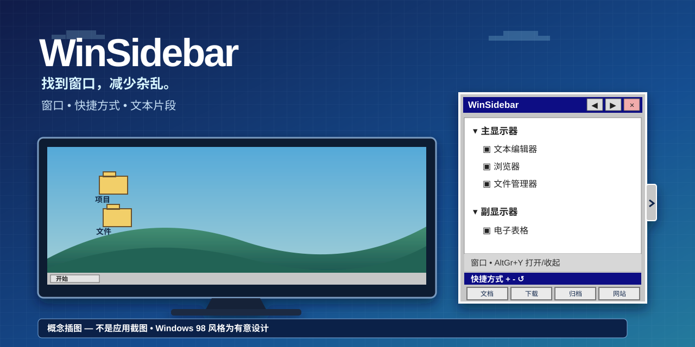

# WinSidebar 2.0

[English](../../README.md) · [Português (Brasil)](README.pt-BR.md) · [Español](README.es-ES.md) · [Русский](README.ru-RU.md) · **简体中文**
## 只想直接使用？

1. 在 Releases 下载 **WinSidebar-v2.0-win-x64.zip**。
2. 解压 ZIP。
3. 双击 **WinSidebar.exe**。

无需安装程序，也无需单独下载 .NET。非技术用户可先阅读 [START-HERE](START-HERE.zh-CN.txt) 或 [常见问题](FAQ.zh-CN.md)。

> **这是概念插图，不是应用程序截图。** Windows 98 风格的外观是有意保留的设计。

WinSidebar 是面向 Windows 10/11 x64 的便携、自包含侧边栏，可用于查找和切换已打开的窗口、打开常用文件夹或网站，以及粘贴可重复使用的文本片段。2.0 是首个同时提供完整五语言运行时、可扩展快捷方式和文本片段的发布系列。

**下载：** [WinSidebar 2.0](https://github.com/hamthet/WinSidebar/releases/tag/v2.0) · **教程：** [简体中文](TUTORIAL.zh-CN.md)

## 2.0 的主要变化

- 应用支持五种语言：英语、巴西葡萄牙语、西班牙语、俄语和简体中文。
- 全新安装默认使用英语；首次启动时可选择任一支持语言。
- 最多 12 个可配置快捷方式，每行 4 个。
- 最多 8 个可重复使用的文本片段，每个片段可设置键盘快捷键。
- 窗口右键菜单支持临时重命名、恢复名称以及持久忽略对应应用。
- 快捷方式和文本片段拥有相互独立的恢复默认功能。
- 侧边栏宽度和高度可循环调整并保存。
- AltGr+Y 可打开或收起侧边栏。
- Windows x64 单文件、自包含 .NET 8 发布；最终用户无需单独安装 .NET。

## 快速开始

1. 下载 2.0 ZIP，并解压到你有权限使用的文件夹。
2. 运行 WinSidebar.exe。
3. 新配置文件中会预选 English；如需要可选择其他语言。
4. 点击窄侧边标签，或按 AltGr+Y 打开/收起侧边栏。
5. 点击窗口列表中的项目即可激活对应窗口。
6. 点击快捷方式即可打开；右键点击可编辑。
7. 点击文本片段会尝试将内容粘贴到最近活动的外部应用；齿轮按钮用于编辑片段。

该程序为便携式且未进行数字签名。Windows SmartScreen 或组织安全策略可能显示警告。

## 键盘操作

- **AltGr+Y** — 打开/收起侧边栏。
- **F1–F4** — 打开快捷方式 1–4。
- **Shift+F1–F4** — 文本片段 1–4 的默认快捷键。
- 每个文本片段可设置为 **无快捷键** 或 **Shift+F1 到 Shift+F12**。不同片段不能使用重复组合。

2.0 不再提供旧版通过 Shift+F 导航窗口列表的行为。

## 快捷方式与文本片段

**快捷方式**部分默认有 4 个项目，最多可扩展到 12 个。+ 每次增加一行 4 个，− 删除最后增加的一行，恢复按钮只恢复快捷方式。左键打开；右键编辑名称、目标、类型、浏览器和图标。

**脚本**部分保存的是纯文本片段，不会执行脚本代码。默认有 4 个项目，最多可扩展到 8 个。+、− 和恢复按钮与快捷方式部分相互独立。点击片段时，WinSidebar 会尝试把焦点交还给之前的外部窗口并粘贴保存的文本。齿轮按钮可编辑名称、内容和快捷键。

## 窗口列表

符合条件的顶层窗口按显示器分组。点击即可激活。窗口右键菜单可以临时重命名窗口、恢复临时名称，或持久忽略对应应用。已忽略的应用可从通用右键菜单中管理。

WinSidebar 使用 Windows 提供的窗口元数据和启发式判断，并不是操作系统 Alt+Tab 的替代实现。

## 语言

支持的运行时语言：

- English — en-US
- Português (Brasil) — pt-BR
- Español — es-ES
- Русский — ru-RU
- 简体中文 — zh-CN

全新安装始终以英语作为默认语言，不受 Windows 显示语言影响。用户选择会保存到 WinSidebar 配置文件中。早期版本中没有 language= 字段的旧配置可能继续使用葡萄牙语，直到用户明确选择其他语言。

## 数据与隐私

WinSidebar 配置文件位于：

    %LOCALAPPDATA%\WinSidebar

其中可能包含 settings.ini、shortcuts.xml、snippets.json、ignored-apps.json、备份文件以及复制的自定义图标。用户自定义的快捷方式名称和路径、片段文本以及外部窗口标题不会被翻译。

WinSidebar 不会设置自动启动，不会更改默认浏览器，也不会发送遥测数据。

文本片段粘贴会临时使用 Windows 剪贴板，并在完成后尝试恢复原内容。Windows 的安全边界可能阻止向以管理员权限运行的应用模拟输入。

## 便携式发布

WinSidebar 2.0 面向 Windows x64，以单个自包含可执行文件发布。.NET 8 runtime 已包含在 WinSidebar.exe 内。最终用户无需另外下载 .NET、PowerShell、Git、编译器或安装程序。

卸载时退出 WinSidebar 并删除可执行文件即可。只有在同时希望删除保存的配置时，才删除 %LOCALAPPDATA%\WinSidebar。

## 源代码与许可证

源代码、语言目录和测试均位于本仓库。WinSidebar 采用 [MIT 许可证](../../LICENSE)。

详细使用方法请参阅[简体中文教程](TUTORIAL.zh-CN.md)。

## 帮助与支持

如果遇到问题，请阅读 [获取帮助](SUPPORT.zh-CN.md)。报告问题不需要技术背景。
